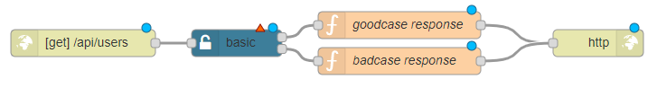

## Problem

You want to secure your Ignite API endpoints with basic authentication.

## Solution

Drag and drop an <code class="node">Http in</code> node to receive the http requests.
Use a <code class="node">basic-auth</code> node and configure the settings.
Drag and drop two <code class="node">Function</code> nodes and set the response for good and bad cases.
Use an <code class="node">Http response</code> node to send the response back to the client

## Example



<b>Flow JSON</b>

```json
[{"id":"7e7aa565.99b9dc","type":"basic","z":"99f38f53.62683","name":"","basicconfig":"","outputs":2,"x":310,"y":340,"wires":[["621d6bf8.a68bc4"],["dfa546fb.7bcc88"]]},{"id":"911dbe22.61ab7","type":"http in","z":"99f38f53.62683","name":"","url":"/api/users","method":"get","upload":false,"swaggerDoc":"","x":140,"y":340,"wires":[["7e7aa565.99b9dc"]]},{"id":"621d6bf8.a68bc4","type":"function","z":"99f38f53.62683","name":"goodcase response","func":"msg.statusCode = 200;\nmsg.payload = [\n    {\n    \"id\": 1,\n    \"name\": \"Ravi Kant Sharma\"\n    },\n    {\n      \"id\": 2,\n    \"name\": \"Bijay Shah\"\n    }\n    ]\nreturn msg;","outputs":1,"noerr":0,"x":490,"y":320,"wires":[["c015c4da.e88ce8"]]},{"id":"c015c4da.e88ce8","type":"http response","z":"99f38f53.62683","name":"","statusCode":"","headers":{},"x":710,"y":340,"wires":[]},{"id":"dfa546fb.7bcc88","type":"function","z":"99f38f53.62683","name":"badcase response","func":"msg.statusCode = 401;\nmsg.payload = {\n    \"message\" : \"username or password is wrong\"\n}\nreturn msg;","outputs":1,"noerr":0,"x":490,"y":360,"wires":[["c015c4da.e88ce8"]]}]
```

## Discussion

This flow verifies the Authorization header of an incoming request against the one defined within the basic-auth settings.

This method is vastly supported including Salesforce Connect with OData Services.