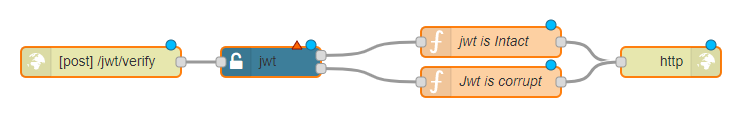

## Problem

You want to verify a JSON web token.

## Solution

Drag and drop an <code class="node">Http in</code> node to create an endpoint to recieve the http requests.
Use a <code class="node">jwt</code> node and configure the settings, select "Verify" from the dropdown.
As soon as you click done, you'll see two outputs from the jwt node. First one is for the Good case[JWT is valid] while the second one is for the Bad case[JWT is corrupt or expired]. Implement your business logic accordignly and send the response back to the client. For this example we are just going to tell the user if the jwt is valid or not.
Use an <code class="node">Http response</code> node to send the response back to the client.

## Example



<b>Flow JSON</b>

```json
[{"id":"4a604514.9dfafc","type":"http in","z":"99f38f53.62683","name":"","url":"/jwt/verify","method":"post","upload":false,"swaggerDoc":"","x":120,"y":180,"wires":[["d012a70d.23de28"]]},{"id":"d012a70d.23de28","type":"jwt","z":"99f38f53.62683","name":"","jwtconfig":"","generatejwt":false,"outputs":2,"x":290,"y":180,"wires":[["ce2c2aa8.eedf48"],["84ad82d.e06a68"]]},{"id":"ce2c2aa8.eedf48","type":"function","z":"99f38f53.62683","name":"jwt is Intact","func":"msg.statusCode =200;\nmsg.payload = {\n    message : \"Jwt is verified\"\n}\nreturn msg;","outputs":1,"noerr":0,"x":510,"y":160,"wires":[["13cac157.1eb0df"]]},{"id":"84ad82d.e06a68","type":"function","z":"99f38f53.62683","name":"Jwt is corrupt","func":"msg.statusCode =401;\nmsg.payload = {\n    message : \"There's an issue with jwt\"\n}\nreturn msg;","outputs":1,"noerr":0,"x":510,"y":200,"wires":[["13cac157.1eb0df"]]},{"id":"13cac157.1eb0df","type":"http response","z":"99f38f53.62683","name":"","statusCode":"","headers":{"content-type":"application/json"},"x":690,"y":180,"wires":[]}]
```

## Discussion

This flow verifies the Authorization header of an incoming request against the one defined within the basic-auth settings.

The jwt node simplifies the authorization process so that our users can focus more on the business logic.