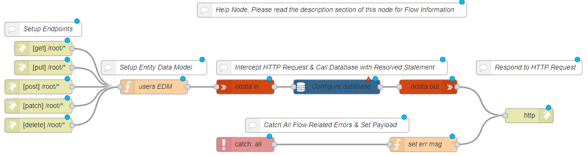

## Problem

You want to create an OData Service inside Ignite using Ignite-Odata & Ignite-Sequelize nodes.

## Solution

Drag and drop an <code class="node">Http in</code> node to receive the http requests for each http verb(GET, POST, PUT, PATCH, DELETE) and connect it to an <code class="node">Odata-in</code> node.
Use a <code class="node">Function</code> node before the <code class="node">Odata-in</code> node OR an <code class="node">EDM</code> node inside the <code class="node">Odata-in</code> node to define your database schema.
Connect the <code class="node">Odata-in</code> node to a <code class="node">Sequelize</code> node and configure your database settings.
Draw a wire from the <code class="node">Sequelize</code> node to an <code class="node">Odata-out</code> node to formulate an OData compliant response.
Use an <code class="node">Http response</code> node to send the http response back to the client.

## Example



<b>Flow JSON</b>

```json
[{"id":"41f23be1.69c874","type":"sequelize","z":"cb420344.e6c35","name":"Configure database","usepayload":false,"query":"","database":"","output":true,"outputs":1,"x":750,"y":300,"wires":[["6ae7ed.93d16814"]]},{"id":"b1965e76.9ab0d","type":"http in","z":"cb420344.e6c35","name":"","url":"/root/*","method":"get","upload":false,"swaggerDoc":"","x":140,"y":220,"wires":[["a15c0aa2.ced248"]]},{"id":"a15c0aa2.ced248","type":"function","z":"cb420344.e6c35","name":"users EDM","func":"msg.model = {\n    namespace: \"ignite\",\n    entityTypes: {\n        \"users\": {\n            \"id\": {\"type\": \"Edm.Int32\", \"key\": true},\n            \"name\": {\"type\": \"Edm.String\"},            \n            \"username\": {\"type\": \"Edm.String\"}            \n        }\n    },   \n    entitySets: {\n        \"users\": {\n            entityType: \"ignite.users\"\n        }\n    }\n}\nreturn msg;","outputs":1,"noerr":0,"x":370,"y":300,"wires":[["3d950901.d084e6"]]},{"id":"869e8f2d.2308d","type":"http response","z":"cb420344.e6c35","name":"","statusCode":"","headers":{},"x":1150,"y":360,"wires":[]},{"id":"7b3b10ba.77d2d","type":"catch","z":"cb420344.e6c35","name":"","scope":null,"uncaught":false,"x":560,"y":420,"wires":[["d7058055.69bc9"]]},{"id":"d7058055.69bc9","type":"function","z":"cb420344.e6c35","name":"set err msg","func":"msg.payload = msg.error.message\nreturn msg;","outputs":1,"noerr":0,"x":930,"y":420,"wires":[["869e8f2d.2308d"]]},{"id":"f5aaa0b3.33224","type":"comment","z":"cb420344.e6c35","name":"Setup Endpoints","info":"","x":140,"y":180,"wires":[]},{"id":"c01201c5.ba4e9","type":"comment","z":"cb420344.e6c35","name":"Setup Entity Data Model","info":"","x":370,"y":260,"wires":[]},{"id":"bbfa4b1c.c9e6b8","type":"comment","z":"cb420344.e6c35","name":"Intercept HTTP Request & Call Database with Resolved Statement","info":"Intercept HTTP Request & Call Database with Resolved Statements.","x":740,"y":260,"wires":[]},{"id":"4b583e62.153a8","type":"comment","z":"cb420344.e6c35","name":"Respond to HTTP Request","info":"","x":1150,"y":260,"wires":[]},{"id":"bd78bc9b.f7ea8","type":"comment","z":"cb420344.e6c35","name":"Catch All Flow Related Errors & Set Payload","info":"","x":730,"y":380,"wires":[]},{"id":"6ae7ed.93d16814","type":"odata out","z":"cb420344.e6c35","name":"","x":940,"y":300,"wires":[["869e8f2d.2308d"]]},{"id":"3d950901.d084e6","type":"odata in","z":"cb420344.e6c35","name":"","x":560,"y":300,"wires":[["41f23be1.69c874"]]},{"id":"68ab84ab.403ddc","type":"http in","z":"cb420344.e6c35","name":"","url":"/root/*","method":"put","upload":false,"swaggerDoc":"","x":140,"y":260,"wires":[["a15c0aa2.ced248"]]},{"id":"53a4d7a0.8f4648","type":"http in","z":"cb420344.e6c35","name":"","url":"/root/*","method":"post","upload":false,"swaggerDoc":"","x":130,"y":300,"wires":[["a15c0aa2.ced248"]]},{"id":"b9a95926.69a178","type":"http in","z":"cb420344.e6c35","name":"","url":"/root/*","method":"patch","upload":false,"swaggerDoc":"","x":130,"y":340,"wires":[["a15c0aa2.ced248"]]},{"id":"e4fb241e.08c3e8","type":"http in","z":"cb420344.e6c35","name":"","url":"/root/*","method":"delete","upload":false,"swaggerDoc":"","x":130,"y":380,"wires":[["a15c0aa2.ced248"]]},{"id":"c357673c.4711b8","type":"comment","z":"cb420344.e6c35","name":"Help Node, Please read the description section of this node for Flow Information","info":"This Flow Helps you create an OData 4.0 service.\n\nOData Service lets you create REST APIs and exchange data using OData Protocol.\n\nIt has everything you need to get your OData Service up and running.You just need to configure two things.\n\n1.Configure you EDM using the function Node or use EDM Node built inside OData-in node to define your metadata model.\n\n2.Define your database connection inside of sequelize Node.\n\nHit \"Deploy\" and you are good to go!","x":740,"y":140,"wires":[]}]
```

## Discussion

An OData service can be used to create OData compliant REST APIs.

In the example flow, we have defined a sample edm "users" using both a <code class="node">Function</code> node and the <code class="node">EDM</code> node.

The <code class="node">Catch</code> node receives the error which passes the message back to the <code class="node">Function</code> node to send an error response.

Read our full blog on "How to create an OData 4.0 Service" <a href="https://www.cgignite.com/post/connect-salesforce-external-objects-to-odata-4-0-apis" target="_blank">here.</a>
