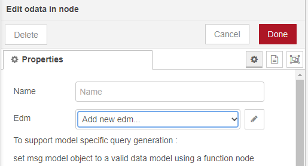
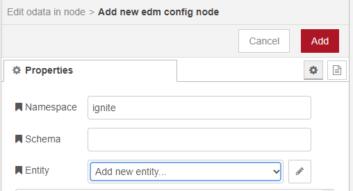
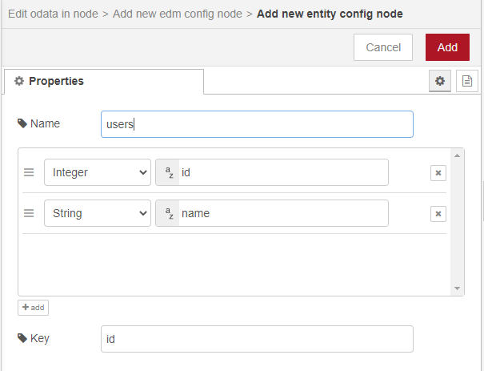

## Problem

You want to define a metadata model using the EDM Node. Populate msg.model property with EntitySets and EntityTypes.

## Solution

Drag and drop an <code class="node">Http in</code> node to recieve requests.
Use an <code class="node">Odata-in</code> node and connect it to <code class="node">Http in</code> node. We will be using this to define our database schema.
Use a <code class="node">Debug</code> node and connect it to the <code class="node">Odata-in</code> node to log out the msg.model in the debug window to verify.<br />
Double click on <code class="node">Odata-in</code> node and select "Add new edm..."
<br />


<br />
Click edit icon and provide the Namespace name and Schema.
<br />
<strong>NOTE: </strong>When schema name is provided schema name is prefixed to the entity names in queries.
<br />


<br />
To add an entity/table select "Add new entity..." and click the edit icon. 
<br />


<br />
Click "Add" and then "Done" to save your changes.

## Example


<b>Flow JSON</b>

```json
[{"id":"75495530.2f6adc","type":"debug","z":"29efa5eb.87dd3a","name":"","active":true,"tosidebar":true,"console":false,"tostatus":false,"complete":"model","targetType":"msg","x":690,"y":140,"wires":[]},{"id":"9abf5f23.f36f5","type":"odata in","z":"29efa5eb.87dd3a","name":"","x":520,"y":140,"wires":[["75495530.2f6adc"]]},{"id":"a62b22db.8b0d6","type":"http in","z":"29efa5eb.87dd3a","name":"","url":"/root/*","method":"get","upload":false,"swaggerDoc":"","x":140,"y":140,"wires":[["cf5f06eb.87b3c8"]]},{"id":"cf5f06eb.87b3c8","type":"function","z":"29efa5eb.87dd3a","name":"users EDM","func":"msg.model = {\n    namespace: \"ignite\",\n    entityTypes: {\n        \"users\": {\n            \"id\": {\"type\": \"Edm.Int32\", \"key\": true},\n            \"name\": {\"type\": \"Edm.String\"},            \n            \"username\": {\"type\": \"Edm.String\"}            \n        }\n    },   \n    entitySets: {\n        \"users\": {\n            entityType: \"ignite.users\"\n        }\n    }\n}\nreturn msg;","outputs":1,"noerr":0,"x":350,"y":140,"wires":[["9abf5f23.f36f5"]]},{"id":"5fd96aa2.daf414","type":"http in","z":"29efa5eb.87dd3a","name":"","url":"/root/*","method":"get","upload":false,"swaggerDoc":"","x":220,"y":1040,"wires":[["b6aba800.71a568"]]},{"id":"b6aba800.71a568","type":"odata in","z":"29efa5eb.87dd3a","name":"","edm":"","x":440,"y":1040,"wires":[["9138050a.ac0888"]]},{"id":"9138050a.ac0888","type":"debug","z":"29efa5eb.87dd3a","name":"","active":true,"tosidebar":true,"console":false,"tostatus":false,"complete":"model","targetType":"msg","x":670,"y":1040,"wires":[]}]
```

## Discussion

The metadata model is used to generate model specific queries and exchange metadata with the OData Connector.

In the example flow, we have defined a sample "users" edm using the <code class="node">EDM</code> node which resides inside the <code class="node">Odata-in</code> node.

This model is used to generate EDMX response for metadata requests.